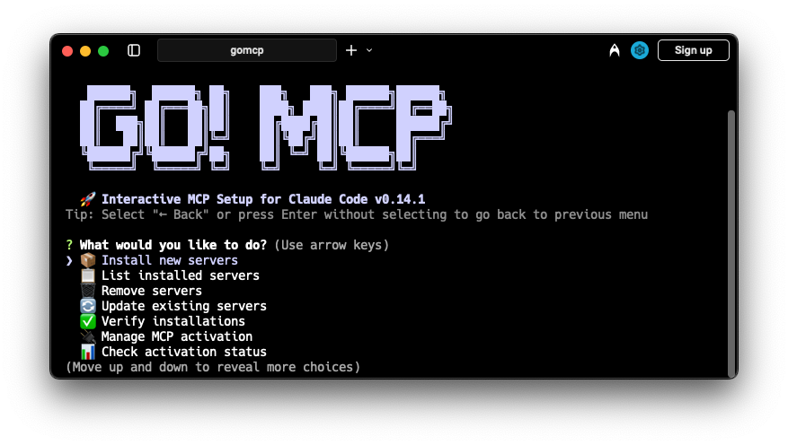

# gomcp - Claude Code用インタラクティブMCPセットアップツール

<div align="center">



</div>

<div align="center">

[English](README.md) | [한국어](README.ko.md) | [日本語](README.ja.md) | [简体中文](README.zh.md) | [Español](README.es.md)

</div>

[](https://badge.fury.io/js/gomcp)
[](https://opensource.org/licenses/MIT)
[](https://nodejs.org)
[](http://makeapullrequest.com)

> 🚀 **Go MCP!** - ゼロから30秒でAIスーパーパワーへ。ツールを選ぶだけ、あとはお任せください。
> 
> 🌐 **多言語サポート** - MCPセットアップの全プロセスを日本語、英語、韓国語、中国語、スペイン語で利用可能。いつでも言語を変更できます！
>
> 📌 **厳選された品質** - 最も有用で多機能なMCPサーバーのみを慎重に選択しています。量より質を重視。

## 目次

- [機能](#機能)
- [クイックスタート](#クイックスタート)
- [インストール](#インストール)
- [使用方法](#使用方法)
- [利用可能なMCPサーバー](#利用可能なmcpサーバー)
- [プリセット](#プリセット)
- [設定](#設定)
- [チームコラボレーション](#チームコラボレーション)
- [コントリビューション](#コントリビューション)
- [ライセンス](#ライセンス)

## 機能

- 📦 **インタラクティブインストール**: ユーザーフレンドリーなチェックボックスインターフェースでMCPサーバーを選択
- 🎯 **スマートな分類**: カテゴリー別に整理されたサーバー（必須、開発、生産性など）
- ⚡ **クイックプリセット**: 一つのコマンドで一般的なサーバーの組み合わせをインストール
- 🔧 **自動設定**: APIキーや設定が必要なサーバーのためのガイド付きセットアップ
- ✅ **検証**: インストールされたMCPサーバーのステータス確認
- 💾 **バックアップ/復元**: MCP設定の保存と復元
- 🌍 **マルチスコープサポート**: グローバルまたはプロジェクト単位でインストール
- 🔄 **アップデート管理**: MCPサーバーを最新の状態に保つ

## クイックスタート

```bash
# npxで直接実行（推奨）
npx gomcp

# またはグローバルインストール
npm install -g gomcp
gomcp
```

## インストール

### npmを使用

```bash
npm install -g gomcp
```

### yarnを使用

```bash
yarn global add gomcp
```

### pnpmを使用

```bash
pnpm add -g gomcp
```

### 必要条件

- Node.js >= 16.0.0
- Claude CodeがインストールされPATHでアクセス可能であること
- Git（一部のMCPサーバーで必要）

## 使用方法

### インタラクティブモード

`gomcp`を実行するだけでインタラクティブメニューが開始されます：

```bash
gomcp
```

以下のオプションを含むメニューが表示されます：
- 🆕 新しいサーバーをインストール（スコープ選択付き）
- 🔄 既存のサーバーを更新
- ✅ インストールを検証
- 💾 設定のバックアップ/復元
- 📋 利用可能なサーバーの一覧
- 🌐 言語を変更

### バックアップと復元

gomcpは柔軟なバックアップと復元オプションを提供します：

**バックアップオプション：**
- 👤 **ユーザー設定のみ** - グローバルMCP設定をバックアップ（~/.claude/config.json）
- 📁 **プロジェクト設定のみ** - プロジェクト固有の設定をバックアップ（.mcp.json）
- 💾 **すべての設定** - ユーザーとプロジェクトの両方の設定をバックアップ

### コマンドラインオプション

```bash
# 異なるスコープでインストール
gomcp                       # インタラクティブモード（スコープを尋ねる）
gomcp --scope user          # グローバルインストール（デフォルト）
gomcp --scope project       # 現在のプロジェクトのみ

# プリセットコレクションをインストール
gomcp --preset recommended  # GitHub、File System、Sequential Thinking
gomcp --preset dev          # 開発ツールプリセット
gomcp --preset data         # データ分析プリセット

# すべての利用可能なサーバーを一覧表示
gomcp --list

# インストールされたサーバーを検証
gomcp --verify

# バージョンを表示
gomcp --version

# ヘルプを表示
gomcp --help
```

### インストールスコープ

#### ユーザー（グローバル）
- すべてのプロジェクトでサーバーが利用可能
- `--scope user`を使用するか、インタラクティブモードで「User」を選択
- デフォルトのスコープ
- 設定場所：`~/.claude/config.json`
- 推奨：汎用ツール（GitHub、File System、Context7）

#### プロジェクト
- 現在のプロジェクトでのみサーバーが利用可能
- `--scope project`を使用するか、インタラクティブモードで「Project」を選択
- `.mcp.json`を作成（チーム共有用）しClaude Codeで有効化
- 設定場所：`./.mcp.json`（プロジェクトルート）
- 推奨：プロジェクト固有のツール（Serena、Memory Bank、データベース接続）

## 利用可能なMCPサーバー

### 必須
- 🐙 **GitHub** - イシュー、PR、CI/CDのためのGitHub API接続
- 📁 **File System** - マシン上のファイルの読み書き
- 📚 **Context7** - ライブラリの最新ドキュメントとコード例へのアクセス
- 🧠 **Sequential Thinking** - 複雑なタスクを論理的なステップに分解

### 開発
- 🐘 **PostgreSQL** - 自然言語でPostgreSQLデータベースをクエリ
- 🌐 **Puppeteer** - Webブラウザの自動化とテスト
- 🎭 **Playwright** - アクセシビリティツリーを使用したクロスブラウザ自動化
- 🐳 **Docker** - コンテナ、イメージ、Dockerワークフローの管理
- 🛠️ **Serena** - セマンティック検索と編集機能を持つ強力なコーディングエージェントツールキット
- 🔧 **Browser Tools** - ブラウザログの監視とブラウザタスクの自動化
- 🌐 **Chrome** - 20以上のツールでChromeブラウザを制御
- 🎨 **Figma** - デザインからコードへのワークフロー統合
- 🍃 **Supabase** - Supabaseデータベースと認証の管理

### 生産性
- 💬 **Slack** - チームコミュニケーションのためのSlack統合
- 📝 **Notion** - Notionワークスペースへのアクセスと管理
- 💾 **Memory Bank** - Claudeセッション間の永続的なメモリ
- 📧 **Email** - メールの送信と添付ファイルの管理
- 📊 **Google Suite** - Google Docs、Sheets、Driveへのアクセス
- 📈 **Excel** - Excelファイルの作成と変更

### データ＆分析
- 📊 **Jupyter** - Jupyterノートブックでのコード実行
- 🔬 **Everything Search** - オペレーティングシステム全体での高速ファイル検索
- 🌍 **EVM** - 30以上のEVMネットワークの包括的なブロックチェーンサービス
- 🔑 **Redis** - データベース操作とキャッシングマイクロサービス

### 検索＆Web
- 🦆 **DuckDuckGo** - APIキー不要のプライバシー重視Web検索
- 🦁 **Brave Search** - APIを使用したプライバシー重視Web検索
- 📸 **Screenshot** - 高度な機能でWebサイトのスクリーンショットをキャプチャ

### 自動化＆統合
- ⚡ **Zapier** - 5,000以上のアプリでワークフローを自動化
- 💳 **Stripe** - Stripe決済APIとの統合
- 🎥 **YouTube** - YouTubeビデオのメタデータとトランスクリプトを抽出
- 🔌 **Discord** - Discordサーバー用のボット自動化

### AI＆ML
- 🤖 **Replicate** - 機械学習モデルの検索、実行、管理
- 🧠 **Hyperbolic** - HyperbolicのGPUクラウドサービスとの相互作用
- 📈 **Databricks** - DatabricksのSQLクエリとジョブ管理

### DevOps＆インフラ
- ☸️ **Kubernetes (mcp-k8s-go)** - Kubernetesポッド、ログ、イベント、ネームスペースの閲覧
- 📊 **HAProxy** - HAProxy設定の管理と監視
- 🌐 **Netbird** - Netbirdネットワークピア、グループ、ポリシーの分析
- 🔥 **OPNSense** - OPNSenseファイアウォール管理とAPIアクセス

### ドメイン＆セキュリティ
- 🔍 **Domain Tools** - WHOISとDNSによる包括的なドメイン分析
- 📡 **Splunk** - Splunk保存検索、アラート、インデックスへのアクセス

### ブロックチェーン＆暗号通貨
- 🟣 **Solana Agent Kit** - Solanaブロックチェーンとの相互作用（40以上のプロトコルアクション）
- ⚡ **EVM** - マルチチェーンEVMブロックチェーン統合

### 求人＆キャリア
- 💼 **Reed Jobs** - Reed.co.ukから求人リストを検索・取得

### 時間＆ユーティリティ
- ⏰ **Time** - 現在時刻の取得とタイムゾーン間の変換
- 🔧 **Everything** - 包括的な機能での高速ファイル検索

### メタツール
- 🛠️ **MCP Compass** - 特定のニーズに適切なMCPサーバーを提案
- 🏗️ **MCP Server Creator** - 他のMCPサーバーを動的に生成
- 📦 **MCP Installer** - 他のMCPサーバーをインストール
- 🔄 **MCP Proxy** - 複数のMCPリソースサーバーを集約

### さらに多くのサーバー...

すべてのサーバーと説明を見るには`gomcp --list`を実行してください。

## プリセット

一般的なサーバーの組み合わせの迅速なインストール：

| プリセット      | 含まれるサーバー                                   | 使用ケース                       |
| -------------- | -------------------------------------------------- | -------------------------------- |
| `recommended`  | GitHub、File System、Sequential Thinking、Context7 | 必須ツールで始める               |
| `dev`          | すべての推奨 + PostgreSQL、Docker、Puppeteer       | 完全な開発環境                   |
| `data`         | Jupyter、Excel、SciPy、PostgreSQL                  | データ分析と可視化               |
| `web`          | Puppeteer、File System、GitHub                     | Web開発と自動化                  |
| `productivity` | Slack、Notion、Memory Bank、Email                  | チームコラボレーション           |

## 設定

### サーバー設定

設定が必要なサーバー（APIキー、トークンなど）をインストールする際、gomcpがセットアッププロセスをガイドします：

```
📝 GitHubを設定：
? GitHub Personal Access Token: **********************
? デフォルトリポジトリ（オプション）: owner/repo
```

### ファイルシステムアクセス

File Systemサーバーの場合、Claudeがアクセスできるディレクトリを選択できます：

```
? アクセスを許可するディレクトリを選択: 
❯◉ ~/Documents
 ◉ ~/Projects
 ◯ ~/Desktop
 ◯ ~/Downloads
 ◯ カスタムパス...
```

## チームコラボレーション

チームで作業する際、プロジェクトスコープのMCPサーバーによりシームレスなコラボレーションが可能になります：

### プロジェクトサーバーのセットアップ

1. **プロジェクトスコープでサーバーをインストール：**
   ```bash
   gomcp --scope project
   # またはインタラクティブモードで「Project」を選択
   ```

2. **`.mcp.json`ファイルをコミット：**
   ```bash
   git add .mcp.json
   git commit -m "Add project MCP servers configuration"
   ```

### チームメンバー向け

`.mcp.json`を含むプロジェクトをクローンする場合：

1. **リポジトリをクローン：**
   ```bash
   git clone <repository-url>
   cd <project-directory>
   ```

2. **Claude Codeを起動：**
   ```bash
   claude
   ```

3. **プロジェクトサーバーを承認：**
   - Claude Codeがプロジェクトのサーバーを承認するよう求めます
   - サーバーを確認し、期待通りであれば承認
   - `/mcp`を使用してサーバーが接続されていることを確認

## コントリビューション

コントリビューションを歓迎します！詳細は[コントリビューションガイド](CONTRIBUTING.md)をご覧ください。

### クイックスタート

1. リポジトリをフォーク
2. 機能ブランチを作成（`git checkout -b feature/amazing-feature`）
3. 変更をコミット（`git commit -m 'Add some amazing feature'`）
4. ブランチにプッシュ（`git push origin feature/amazing-feature`）
5. Pull Requestを作成

## ライセンス

このプロジェクトはMITライセンスの下でライセンスされています - 詳細は[LICENSE](LICENSE)ファイルをご覧ください。

---

<p align="center">
  Claude Codeコミュニティのために❤️を込めて作りました
</p>

<p align="center">
  <a href="https://github.com/coolwithyou/gomcp/issues/new?assignees=&labels=bug&template=bug_report.md&title=">バグ報告</a>
  ·
  <a href="https://github.com/coolwithyou/gomcp/issues/new?assignees=&labels=enhancement&template=feature_request.md&title=">機能リクエスト</a>
  ·
  <a href="https://github.com/coolwithyou/gomcp/discussions">ディスカッションに参加</a>
</p>