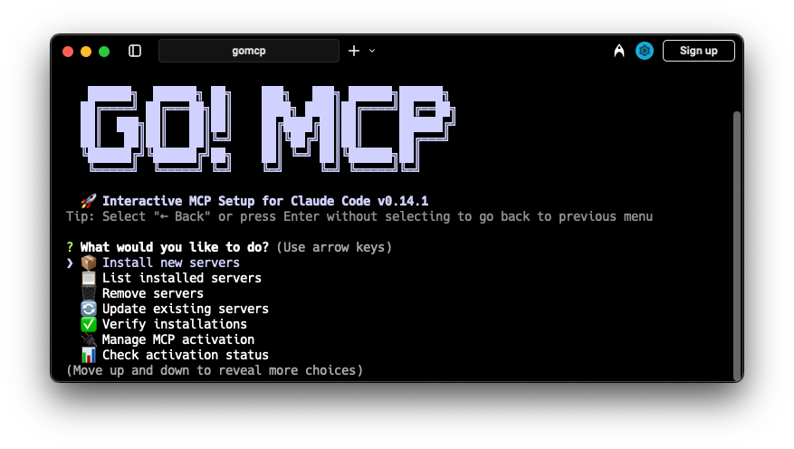

# gomcp



[English](README.md) | [한국어](README.ko.md) | [日本語](README.ja.md) | [简体中文](README.zh.md) | [Español](README.es.md)

[](https://badge.fury.io/js/gomcp)
[](https://opensource.org/licenses/MIT)

Claude Code용 MCP 서버를 쉽게 설정할 수 있는 도구입니다. 필요한 도구를 선택하면 설치와 설정을 알아서 해드려요.

## 빠른 시작

```bash
# 그냥 이렇게 실행하세요:
npx gomcp

# 전역으로 설치하고 싶다면:
npm install -g gomcp
gomcp
```

끝! 대화형 메뉴가 모든 걸 안내해드릴 거예요.

## 이게 뭔가요?

Claude Code를 쓰고 계신다면, 아마 여러 도구들(MCP 서버라고 부릅니다)을 연결하고 싶으실 거예요. GitHub, 파일 시스템, 데이터베이스 같은 것들이요. 수동으로 설정하기는 좀 귀찮죠. 이 도구가 그걸 쉽게 만들어드립니다.

## 기능

- 원하는 서버를 선택할 수 있는 대화형 메뉴
- 설치와 설정을 모두 알아서 처리
- 전역 설치와 프로젝트별 설치 모두 지원
- 설정 백업과 복원
- npm, yarn, pnpm 모두 사용 가능

## 설치

설치할 필요 없어요. 그냥 이렇게 쓰면 됩니다:
```bash
npx gomcp
```

전역으로 설치하고 싶다면:
```bash
npm install -g gomcp
# 또는 yarn global add gomcp
# 또는 pnpm add -g gomcp
```

요구사항: Node.js 16 이상, Claude Code가 설치되어 있어야 합니다.

## 사용 방법

### 대화형 모드 (추천)

그냥 실행하세요:
```bash
gomcp
```

메뉴에서 이런 걸 할 수 있어요:
- 새 서버 설치
- 기존 서버 업데이트
- 설치된 것 확인
- 설정 백업/복원
- 언어 변경 (한국어, 영어, 일본어, 중국어, 스페인어 지원)

### 명령줄 옵션

뭘 원하는지 안다면:
```bash
# 프리셋 설치
gomcp --preset recommended  # 기본적인 것들로 시작
gomcp --preset dev         # 개발 작업용
gomcp --preset data        # 데이터 분석용

# 기타 유용한 명령
gomcp --list               # 사용 가능한 서버 모두 보기
gomcp --verify             # 뭐가 설치됐는지 확인
gomcp --scope project      # 현재 프로젝트에만 설치
```

### 설치 범위

**사용자 (전역)** - 기본값입니다. 모든 프로젝트에서 서버가 작동해요.

**프로젝트** - 현재 프로젝트에만. 팀 협업에 좋아요. `.mcp.json` 파일이 생성되고 이걸 커밋할 수 있습니다. 팀원들이 레포를 클론하면 Claude Code가 서버 승인을 요청할 거예요.

## 사용 가능한 서버

카테고리별로 정리된 MCP 서버들이 있습니다. 인기 있는 몇 가지를 소개하면:

**필수 도구**
- GitHub - 레포, 이슈, PR 작업
- File System - 로컬 파일 읽기/쓰기
- Context7 - 모든 라이브러리의 문서 가져오기
- Sequential Thinking - 복잡한 작업 나누기
- Serena - 스마트 코드 편집 도우미

**개발**
- PostgreSQL, Docker, Puppeteer, Supabase

**생산성**
- Slack, Notion, Memory (지식 그래프)

**AWS 도구**
- CDK부터 Lambda, RDS까지 다양한 도구

...그리고 더 많이 있습니다. `gomcp --list`로 전체 목록을 확인하세요.

## 프리셋

서버를 하나하나 고르기 귀찮으신가요? 프리셋이 있습니다:

- `recommended` - 기본적인 걸로 시작
- `dev` - 전체 개발 설정
- `data` - 데이터 분석용
- `web` - 웹 개발 도구
- `productivity` - 팀 협업
- `aws` - AWS 개발

## 설정

서버에 API 키나 설정이 필요하면 설치 중에 물어봅니다. 예를 들어 GitHub는 개인 액세스 토큰을 요청할 거예요.

File System 서버의 경우 Claude가 접근할 수 있는 디렉토리를 선택합니다. 간단해요.

설정 파일 위치:
- `~/.claude/config.json` (사용자 설정)
- `./.mcp.json` (프로젝트 설정)

## 팀 협업

팀에서 작업하세요? 프로젝트 범위를 사용하세요:

1. 서버 설치: `gomcp --scope project`
2. `.mcp.json` 파일 커밋
3. 팀원들이 레포를 클론하고 `claude`를 실행하면 서버 승인 요청을 받음

끝! 모두 같은 설정을 쓰게 됩니다.

## 개발

기여하고 싶으세요?

```bash
git clone https://github.com/coolwithyou/gomcp.git
cd gomcp
npm install
npm run build
npm test
```

코드는 꽤 직관적입니다 - TypeScript로 되어 있고, UI는 Inquirer를 사용하고, 표준 npm 관행을 따릅니다.

## 기여하기

자유롭게 기여해주세요! 포크하고, 수정하고, PR 보내주세요. 기여에 대해 별로 까다롭지 않습니다 - 테스트만 통과하면 돼요.

## FAQ

**MCP가 뭐예요?**  
Claude Code가 외부 도구들과 연결할 수 있게 해주는 프로토콜입니다.

**gomcp를 어떻게 업데이트하나요?**  
`npm update -g gomcp`

**Claude Code 없이 사용할 수 있나요?**  
아니요, Claude Code 전용입니다.

**서버를 어떻게 제거하나요?**  
gomcp 실행, "기존 서버 업데이트"로 가서 원하지 않는 것 체크 해제.

## 라이선스

MIT - 마음대로 쓰세요.

---

MCP를 만들어준 Claude Code 팀과 다양한 MCP 서버에 기여한 모든 분들께 감사드립니다. 진짜 대단하신 분들이예요.

[버그 보고](https://github.com/coolwithyou/gomcp/issues) | [기능 요청](https://github.com/coolwithyou/gomcp/issues) | [토론](https://github.com/coolwithyou/gomcp/discussions)